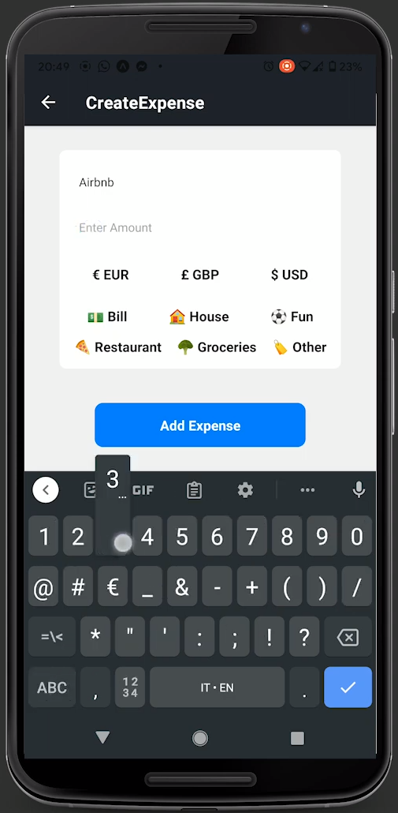

<div id="top"></div>

<br />
<div align="center">
  <a href="https://github.com/Fav8/groupay">
    
  </a>

<h3 align="center">GrouPay</h3>

  <p align="center">
    A full stack tool to manage shared expenses 
    <br />
    <a href="https://github.com/Fav8/groupay"><strong>Explore the docs »</strong></a>
    <br />
    <br />
    <a href="https://www.youtube.com/watch?v=1kLm0Uf5Gy8">View Demo</a>
    ·
    <a href="https://github.com/Fav8/groupay/issues">Report Bug</a>
    ·
    <a href="https://github.com/Fav8/groupay/issues">Request Feature</a>
  </p>
</div>


<!-- TABLE OF CONTENTS -->
<details>
  <summary>Table of Contents</summary>
  <ol>
    <li>
      <a href="#about-the-project">About The Project</a>
      <ul>
        <li><a href="#built-with">Built With</a></li>
      </ul>
    </li>
    <li>
      <a href="#getting-started">Getting Started</a>
    </li>
  </ol>
</details>


<!-- ABOUT THE PROJECT -->
## About The Project
<div align="center">
   <a href="https://github.com/Fav8/groupay">
    
  </a>
</div>
GrouPay was built during Codework's bootcamp as the solo project.
While coding it, Notion was my tool of chioce to manage tasks and note bugs or quick fixes I needed to do.
Working on the back end first was the right move, because even tough I was constatly fiddling with it building the front end because I noticed I needed different data from what I planned, it was a very easy process having my fundamentals down.
Having a ready to use back also helped with coding the mobile version in 1 day without prior experience of React Native.


[Check out the desktop front end and the back end here](https://github.com/Fav8/groupay)

<p align="right">(<a href="#top">back to top</a>)</p>


### Built With

* [React.js](https://reactjs.org/)
* [Bootstrap](https://getbootstrap.com)
* [React Native](https://reactnative.dev/)
* [MongoDB](https://www.mongodb.com/)
* [Mongoose](https://mongoosejs.com/)
* [Firebase](https://firebase.google.com/)
* [Express](https://expressjs.com/)

<p align="right">(<a href="#top">back to top</a>)</p>
<div align="center">
  <a href="https://github.com/Fav8/groupay">
      
    </a>
 </div>

<!-- GETTING STARTED -->
## Getting Started

To get a local copy up and running follow these simple example steps.
* Clone the repo;
* Run npm install
  ```sh
  npm install
  ```
 * Create your Firebase Auth instance, follow the official docs [here](https://firebase.google.com/)
